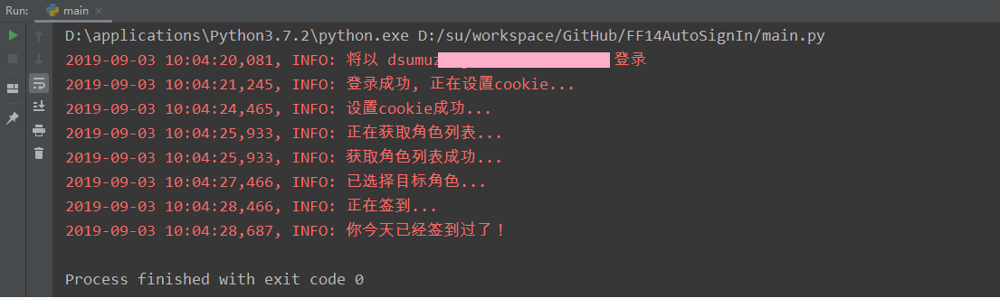

#  FF14 国服官网自动签到脚本

1.作用  
&nbsp;&nbsp;使用 python 的 requests 库, 实现 FF14 国服官网自动签到, 暂不支持 WeGame 帐号.  
示例:  

2.安装
  1. 安装 Python 解释器 [Python 官网](https://www.python.org/)
  2. 下载项目源码
  3. 进入项目根目录, 执行命令 `pip -r requirements.txt` 安装 `requests` 库

3.用法
  1. 修改项目根目录下的 `config.py` 文件, 添加登录参数
  2. 进入项目根目录, 执行命令 `python main.py`, 完成签到
